重要更新

翱翔助手 v1.9.1 已发布

本次更新重点修复统一身份认证错误提示，并优化登录后的后台同步流程，建议所有用户更新。

1. 修复错误账号或翱翔门户密码只显示“登录信息失效”的问题。
2. 修复切换账号以及更新成绩、课表、电费时，密码或验证码错误没有明确提示的问题。
3. 登录验证成功后，成绩、课表和电费会在后台依次同步，不再显示采集网页。
4. 采集状态统一为“正在登录”“正在打开目标页面”“正在读取数据”。
5. 每天 00:00–01:00 暂停电费查询，手动更新会提示电费系统正在结算，自动更新会在 01:00 后恢复。

下载地址

https://gitcode.com/lorcas/aoxiang-assistant/releases/download/v1.9.1/aoxiang-assistant-v1.9.1.apk

反馈地址

用户交流群：450804497

https://github.com/Lorcas-Zephyr/aoxiang-assistant/issues

反馈同步问题时，请隐藏学号、姓名、密码、Cookie、宿舍号和其他个人信息。

课表、成绩、GPA、宿舍电费，不用在多个网页之间来回切换。

翱翔助手面向西北工业大学学生，使用校内统一身份认证，在一个界面里集中查看学习和生活信息。

主要功能：

1. 在 App 内统一登录教务系统和一卡通平台。
2. 导入和查看周课表、月历课表，点击课程查看教师和教室。
3. 查看全部课程成绩、学分、绩点、GPA、加权成绩和成绩构成。
4. 查询宿舍剩余电费，并设置余额不足提醒。
5. 添加今日课表和今明课表桌面小组件。
6. 在本地保存和管理课表数据，支持数据导入导出。

自动更新和提醒

成绩、课表和电费可以分别开启后台自动更新。每项数据都可以单独设置更新数值和单位，支持分钟、小时、天三种单位，数值可以直接输入。

后台更新由系统定时唤醒，在设备空闲时完成采集，不需要手动打开网页。课表发生调课、课程周次或地点变化时，可以通知具体课程；成绩发生变化时，可以通知具体课程成绩。电费低于自定义余量时，也会发送余额不足提醒。

需要注意的是，Android 13 及以上版本要允许通知；部分手机还需要允许应用后台运行并关闭电池优化，否则系统可能延迟自动更新。

翱翔助手是非官方校园工具，与西北工业大学及相关系统运营方不存在隶属关系。请遵守学校相关系统的使用规定。

详细使用说明

说明：以下截图来自模拟器示例，页面中的课程、成绩、电费和账号仅用于展示界面。实际数据以个人账号和学校系统返回结果为准。

一、安装与登录

1. 从上面的下载地址下载最新 APK。
2. Android 首次安装时，如果系统提示“允许安装未知应用”，请按系统提示允许当前浏览器或文件管理器安装。
3. 打开翱翔助手后默认进入首页。进入“设置”→“账号”，点击“登录”或“更换账号”。
4. 输入学号和翱翔门户密码，按页面提示完成登录；如果学校系统要求短信验证码，按弹窗填写验证码。密码或验证码错误时，App 会明确提示并允许重新输入。
5. 登录过程在 App 内完成，不需要手动打开教务系统网页。一卡通电费和教务数据使用同一套 App 登录信息。
6. 登录验证成功后，成绩、课表和电费会在后台依次同步，可以直接返回其他页面继续使用。

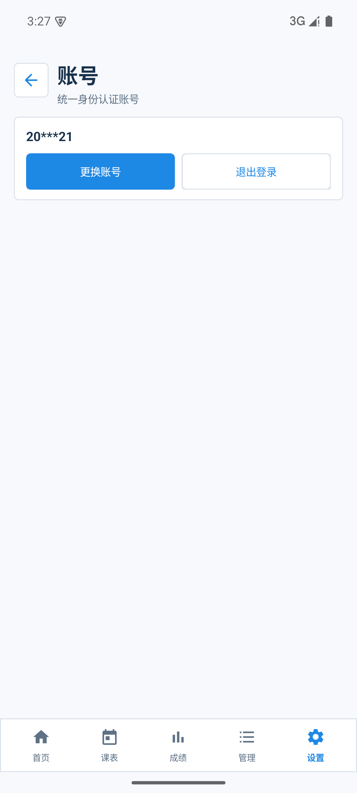

二、首页

首页集中显示当前学期、当前周次、GPA、加权成绩、课程数量、剩余电费和今日课程。

成绩和电费区域上方分别有“更新成绩”和“更新电费”按钮。需要立即获取最新数据时，点击对应的更新按钮；自动更新开启后不需要手动操作。

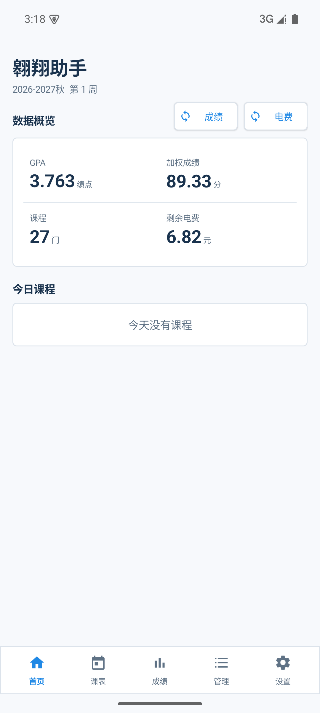

三、导入课表

1. 进入底部导航的“管理”页面。
2. 在“课表同步”区域点击“导入课表”。
3. App 会使用统一身份认证自动打开教务系统目标页面并采集课表，不需要复制网页内容。
4. 导入完成后会自动切换到课表页面，并显示导入课程数量。
5. 新建或新导入的学期默认按 17 周生成；如果课程真实排到第 17 周以后，学期会自动延长到课程结束周。已经保存的学期周数不会因为升级被改动。
6. 学期开始日期会自动调整为所选日期及之前最近的周一，避免周次错位。

“管理”页面还可以：

1. 点击“手动更新”重新从教务系统采集课表。
2. 新增、编辑、删除学期，并选择当前学期。
3. 查看当前学期全部课程、所有排课周次、教师和地点。
4. 在“设置”→“数据”中导入或导出本地课表数据，用于备份或迁移。

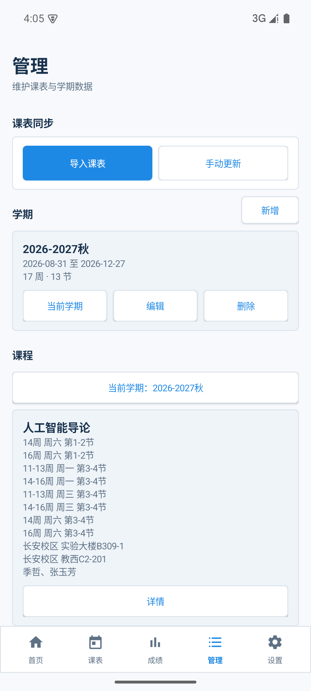

四、查看周课表和月历

1. 在底部导航点击“课表”。
2. 顶部可以切换学期；左右箭头或左右滑动可以切换上一周和下一周。
3. 点击“本周”可以回到当前日期所在周。
4. 点击“月历视图”可以按月份查看整月安排；月历中的课程使用颜色圆点表示，点击“周视图”返回七天课表。
5. 点击有课的格子，可以查看这一节课对应的教师和上课地点。课程管理页则显示该课程的全部教师、地点和所有排课周次。
6. 课表中的时间按学校作息显示，例如 08:30-09:15、09:25-10:10、10:30-11:15。

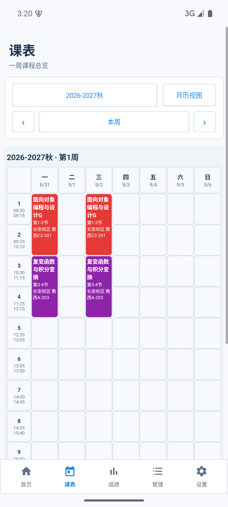

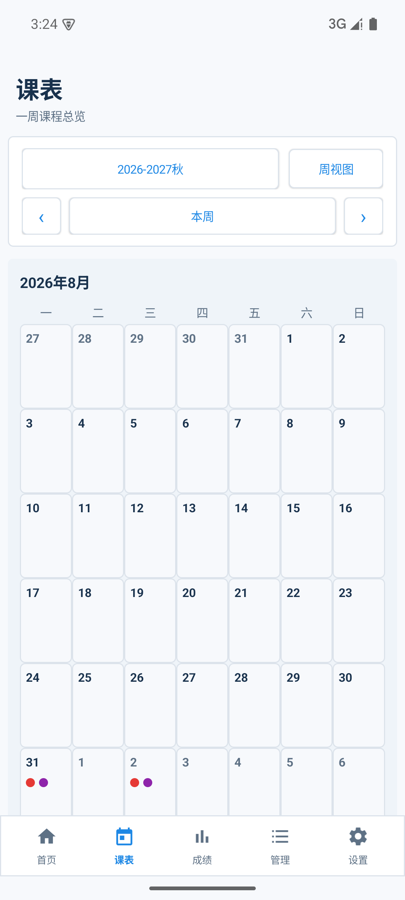

五、查看和更新成绩

1. 在底部导航点击“成绩”。
2. 页面顶部显示课程总数、GPA、加权成绩和课程数量。
3. 成绩明细中可以查看课程成绩、学分、绩点，以及期末、平时、实验等成绩构成。
4. 点击页面右上角的更新图标，可以手动从教务系统更新成绩。
5. 开启成绩变化通知后，后台检测到课程成绩变化会发送通知，并列出发生变化的课程名称。

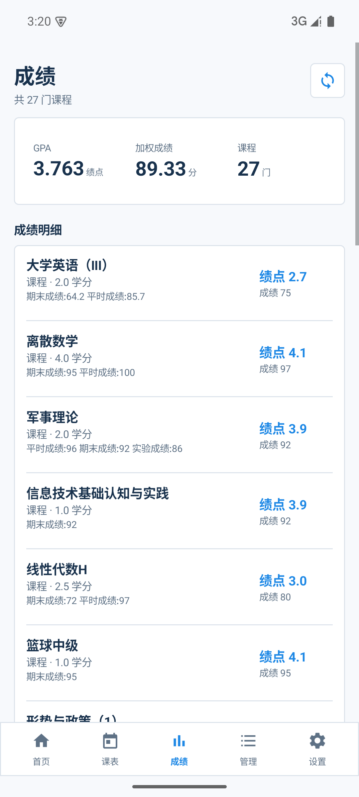

六、查询电费和设置提醒

1. 首页的“剩余电费”显示最近一次采集结果。
2. 点击首页上方“更新电费”可以立即从一卡通平台更新余额。
3. 进入“设置”→“电费提醒”，打开“余额不足提醒”。
4. 输入报警余量并点击“保存余量”，例如设置为 10 元；当余额低于该数值时，App 会发送提醒。
5. 在同一页面点击“立即更新”，也可以直接触发一次电费采集。
6. 每天 00:00–01:00 为电费系统结算时段，期间手动更新会显示结算提示，自动更新会推迟至 01:00 后继续。

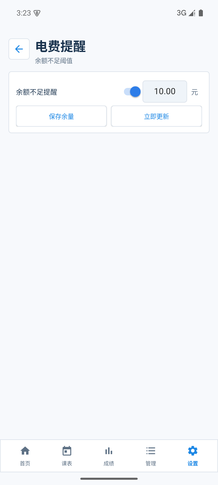

七、后台自动更新

1. 进入“设置”→“自动更新”。
2. 成绩、课表、电费可以分别打开或关闭自动更新。
3. 在“更新间隔”中直接输入 1 到 999 的数值，也可以使用加减按钮调整。
4. 右侧单位可以选择“分钟”“小时”或“天”。
5. 打开“开机后恢复自动更新”，手机重启后会按原设置恢复后台任务。
6. 自动更新由系统定时唤醒，在后台完成采集，不会把教务网页显示在 App 页面中。系统可能会在后台运行期间显示短暂的系统同步通知，这是 Android 对后台任务的正常提示。
7. 如果长时间没有更新，请检查网络、通知权限、电池优化和系统的后台运行限制。
8. 电费系统每日 00:00–01:00 结算期间只暂停电费查询，不影响成绩和课表更新。

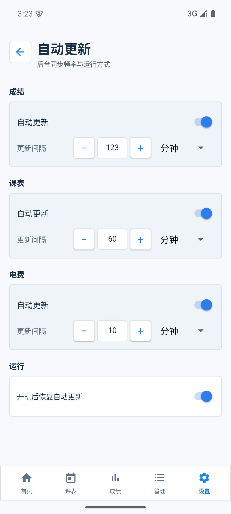

八、成绩和课表变化通知

1. 进入“设置”→“通知”。
2. 分别打开“成绩有更新时通知”和“课表有更新时通知”。
3. 成绩通知会提示具体课程的成绩发生变化；课表通知会提示具体课程的排课发生变化，可以一次列出一门或多门课程。
4. Android 13 及以上版本需要允许翱翔助手发送通知，否则系统会拦截提醒。

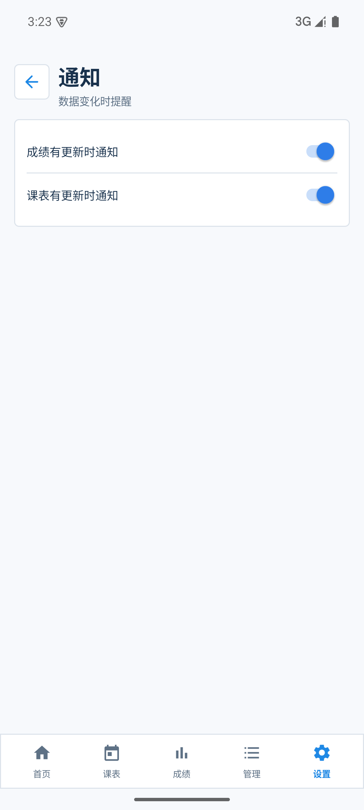

九、桌面课表小组件

1. 在手机桌面长按空白处，选择“小组件”或“添加小组件”。
2. 找到“翱翔助手”。
3. 选择“今日课表 · 2×2”，添加后显示当天课程；选择“今明课表 · 4×2”，添加后左右并列显示今天和明天。
4. 点击小组件中的课程可以进入课表页面；点击空白区域也可以进入课表页面。
5. 两天小组件的左右两栏可以分别点击；当天课程过多时，在小组件内上下滚动查看。
6. 课表更新后小组件会自动刷新。

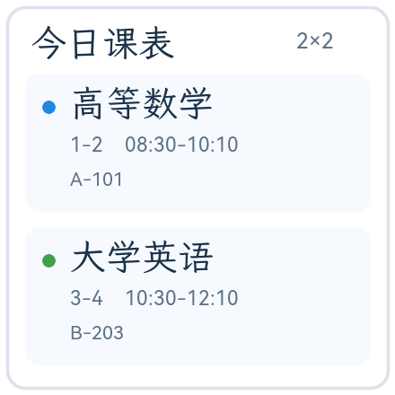

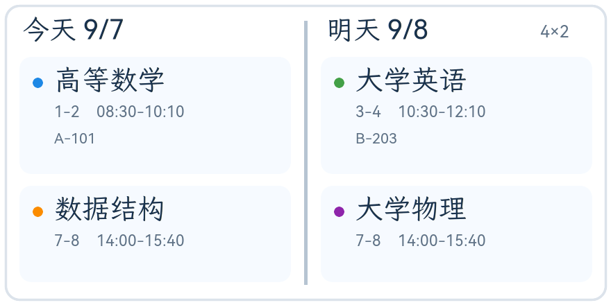

十、外观、数据和关于

在“设置”页面可以进入以下二级面板：

1. “外观”：切换浅色或深色模式，选择主题色。
2. “数据”：导入或导出本地课表数据。
3. “关于”：查看版本、项目地址、开源许可和非官方应用说明。
4. “账号”：更换账号或退出登录。

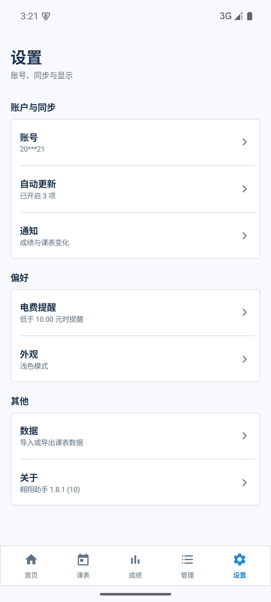

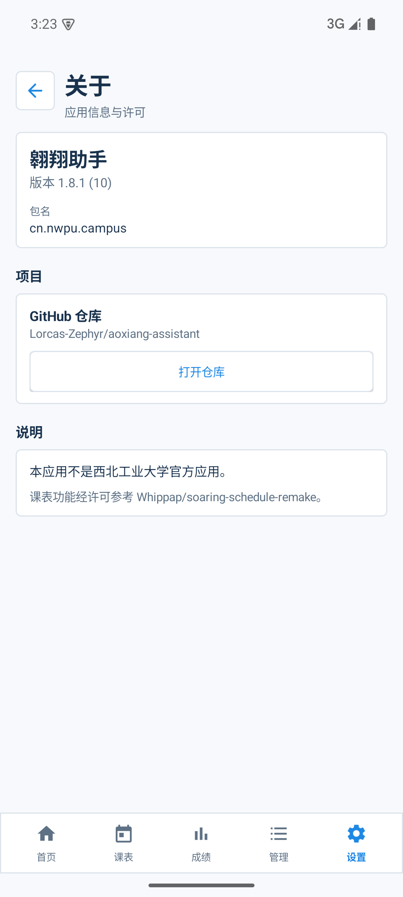

十一、退出登录和隐私

1. 进入“设置”→“账号”，点击“退出登录”。
2. 退出后会清除本地账号、登录 Cookie、成绩、课表、电费缓存和相关更新通知。
3. 账号凭据使用 Android Keystore 加密后保存在手机私有存储中，成绩、课表和电费采集在设备端完成，不上传到开发者服务器。
4. 翱翔助手是非官方应用。学校系统页面或接口发生变化时，同步功能可能需要等待版本适配。
5. 反馈问题时请隐藏学号、姓名、密码、Cookie、宿舍号和其他个人信息。
